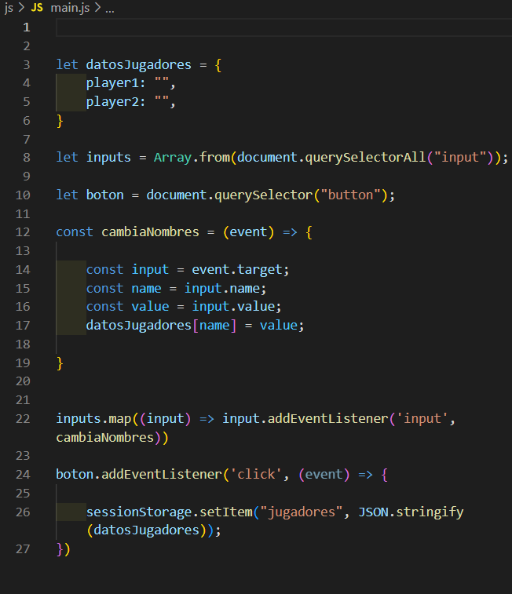

# FFVII TIC TAC TOE

Este es un proyecto el cual esta realizado para el curso fsd de GeeksHubs Valencia. En dicho proyecto vamos estar viendo un Tic Tac Toe funcional. 

He querido basarlo en los "menu boxes" del videojuego "Final Fantasy VII" lanzado en el año 1997. 

Para todo aquel que desconozca como es el diseño de dicho menu os lo pongo a continuación.

## Tecnologías utilizadas

---

Hemos utilizado las siguientes tecnologías: 

* HTML
* CSS
* Bootstrap
* JavaScript

---

### Capturas y explicación del proyecto

Bootstrap ha sido clave en este proyecto, tanto el responsive de la web como la colocación de todos los elementos mostrados en pantalla han sido con bootstrap.

Aqui teneis un ejemplo del codigo donde usamos bootstrap para la posición de los elementos:

Y aqui el resultado deseado:

Para todas las "boxes" del proyecto hemos utilizado practicamente la misma estructura con ligeras variaciones entre unas y otras, aqui un ejemplo del CSS:

Y aqui el resultado basandonos en el menu del videojuego "Final Fantasy VII":

Para la parte del "button" al ser un "anchor" aparecia el texto subrayado, azul y me molestaba, así que con el código

        text-decoration: none;

en el css del anchor conseguí que no rompiera la homogeneidad.

Lo siguiente a realizar sería recoger el valor de los "inputs" y guardarlos en el "session storage" para que los nombres introducidos en los "inputs" puedan aparecer en la pantalla de juego. Aqui teneis el codigo utilizado para realizar dichas acciones: 

---

Pasamos a la página del juego y continuamos con la misma estética de "final fantasy VII".

A continuación teneis el CSS del tablero y sus celdas:

---

Comenzamos con la lógica del tablero. Lo primero que tenemos que hacer es recoger los datos del "session storage":

Acto seguido mostramos los nombres introducidos en los inputs y guardados en el "session storage":

Continuamos con el temporizador el cual comienza pasados 1 segundo de entrar en la página del juego. A su vez muestra un mensaje y detiene el juego pasados 60 segundos.

Para el tablero declaramos las variables y la tabla de las combinaciones ganadoras al comienzo:

Despues nos encargamos de poder poner las "X" y las "O":

Para finalizar realizamos las funciones para comprobar las "X", las "O", guardarlas y poder comparar sus posiciones con las de combinaciones ganadoras:

---

## Agradecimientos

Me gustaría agradecer a todos mis compañeros los cuales me estan ayudando siempre, al igual que los docentes y no puedo olvidarme de mi buen amigo Adrian quien siempre esta dispuesto a echarme una mano sea cuando sea.

---